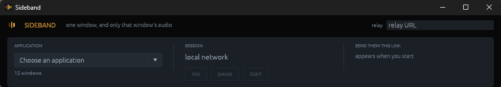

<p align="center">
  
</p>

<h1 align="center">Sideband</h1>

<p align="center">
  Stream one application to one person, with <strong>only that application's audio</strong>.<br>
  No call, no account, nothing installed on their end.
</p>

<p align="center">
  
</p>

---

You pick a window. They open a link and click Watch. They hear that window and
nothing else, not your other tabs, not your voice chat, not your notifications.

Link-based browser screen sharing already exists, and so does proper per-process
capture. What doesn't exist is both at once. Tools that share to a browser capture
through `getDisplayMedia`, which can give a tab's audio or the whole system's,
but never one process's. Tools that capture properly need an install and an account
on the viewing end. Sideband sits in both columns.

## Requirements

- Windows 10 version 2004 or newer, which is where the process-loopback audio API arrived
- An NVIDIA GPU, because the encoding is NVENC
- The viewer needs a browser. That's all.

## Install

```powershell
cargo build --release
powershell -ExecutionPolicy Bypass -File install.ps1
```

That copies the executable to `%LOCALAPPDATA%\Programs\Sideband` and makes a Start
menu and desktop shortcut. It has to be copied somewhere rather than run from
`target/release`, because that is a build directory. `cargo clean` empties it, and
anything pinned to the taskbar breaks when it does.

Run the script again after a rebuild to update the installed copy, or with
`-Uninstall` to take it back off. No administrator rights, nothing written outside
your own profile.

## Use it

Open Sideband, pick an application, press start. You get a link, and a six-character
code if you're going through a relay. Send either one.

There is a command line too, driving the same engine:

```
sideband                      pick a window and share it
sideband share  [pid] [relay] pair by code through a relay
sideband stream [pid] [port]  serve the viewer page yourself
```

**On a LAN or a tailnet you need no relay at all.** `sideband stream` serves its
own viewer page and nothing external is involved.

**Switching applications** - pick a different one at any point and the stream
follows it, picture and audio both. Nothing is torn down: same connection, same
code, same viewer, who simply starts seeing something else. In a terminal, press
Enter for the list and type a number.

**Auto admit** - off by default. With it on, whoever opens the link is let
straight in and nothing is asked on your end, which is what you want if you are
not sitting at the keyboard when they arrive. It also makes the code the only
thing between them and your screen, so it is a per-machine choice and it is
remembered.

**Microphone** - off by default. **Ctrl+Alt+M** toggles it globally, so it works
without leaving the game. Pick which one with **mic device**; the level meter runs
whether or not the mic is live, so you can confirm you chose the right one without
going live first.

A meter reading 0% is not on its own a fault. A noise-gated microphone, which is
what the vendor mixer suites set up by default, reads exactly zero until you
speak and then jumps, and that is it working correctly. What the meter is for is
the difference between that and a device that stays at zero while you are
talking, which is the one you cannot hear by listening to yourself. `sideband
mics` lists the capture devices and `sideband mic` shows the level of one.

**Volume** - the captured application is amplified to something audible before it
is sent, and held there as you switch between applications. This is not optional
and there is no slider, because the level that reaches the viewer has almost
nothing to do with the level you hear: your master volume, the per-application
slider in the mixer and your headset's own amplifier are all downstream of what
gets captured, and none of them are in it. Measured here, a game sat 11 dB below
a chat application while both sounded normal in the room. Sent as captured, that
is a viewer at full volume still straining to hear. Your microphone is mixed in
afterwards at its own level, so a loud game never ducks your voice.

**Quality** - there is no quality setting, because the right one is a property of
the viewer's connection and neither of you knows it. A session opens at 2.5 Mbit/s
and 30 fps, low enough for almost any home link to carry from the first frame, and
climbs to 1080p60 at 10 Mbit/s over the next ten to twenty seconds if the viewer
keeps reporting a clean path. If they stop, it comes back down quickly.

**"They cannot hear it"** - watch the `app` level while the stream runs. Process
loopback delivers evenly paced packets whether or not the application is making
a sound, and it accepts any process at all without complaint, so a packet count
alone never proves anything is being heard. The level does. If it sits at zero
while the application is plainly audible to you, the audio is being taken from
the wrong process; if it moves, the audio is leaving this machine and the
problem is at the other end. Note that many games mute themselves when they are
not the focused window, which reads as silence here and is the application doing
it, not Sideband.

When a stream misbehaves and you want to know why, `SIDEBAND_DEBUG_RATE=1` prints a
line a second with what the viewer actually reported and what was decided from it.

---

# Setting up a relay

**You only need this to share with someone outside your network.** On a LAN or a
tailnet, skip the whole section.

The relay is a Cloudflare Worker that holds an SDP offer and an SDP answer for five
minutes so two machines that cannot reach each other directly can swap them, then
gets out of the way. **It never carries video or audio.** Once the two ends have
exchanged those blobs they talk to each other directly, and the relay is done.

That is why it costs essentially nothing to run: about six requests per session, on
a free plan that allows 100,000 a day.

### One command

```bash
cd worker
./setup.sh
```

The script checks you are logged in, creates the Durable Objects the relay needs,
deploys it, and then probes the live URL to prove it works. It prints the address at
the end.

### Or by hand

```bash
cd worker
npx wrangler login
npx wrangler deploy
```

There is nothing to configure. State lives in Durable Objects, which need no
namespace ids in `wrangler.toml`, so the file in this repo works as it stands.

To run one locally instead while you poke at it:

```bash
npx wrangler dev --port 8787
```

### Point Sideband at it

Paste the URL into the relay box in the window. It is remembered, so this is
something you do once rather than once a session. It lives in
`%APPDATA%\Sideband\settings`, a plain text file you can open, edit or delete.

For the command line, either pass it explicitly or set it in the environment:

```bash
export SIDEBAND_RELAY=https://sideband.<your-subdomain>.workers.dev
```

A remembered relay beats `SIDEBAND_RELAY`: the variable seeds a machine that has
never been told one, but a box that ignored what you typed into it would be worse
than a box that never remembered anything.

### What it costs

| Resource | Per session | Free tier | Headroom |
|---|---|---|---|
| Worker requests | ~6 | 100,000/day | ~16,000 sessions/day |
| Durable Object writes | a handful | generous | not the limit |

The only line worth watching is TURN relay bandwidth, which applies when hole
punching fails, which usually means carrier-grade NAT. That is a separate Cloudflare Realtime
product with its own 1,000 GB/month allowance, and at roughly 4.5 GB/hour it covers
about 220 hours of relayed streaming in the worst case where every session relays.
Most home-to-home connections go direct and use none of it.

TURN is optional and configured through the environment:

```bash
export SIDEBAND_CF_TURN_KEY_ID=...      # Cloudflare Realtime
export SIDEBAND_CF_TURN_TOKEN=...
# or any provider
export SIDEBAND_TURN_URL=turn:...
export SIDEBAND_TURN_USER=...
export SIDEBAND_TURN_PASS=...
```

Without it, connections fall back to STUN only. Most work; the ones behind CGNAT
will not.

See [worker/README.md](worker/README.md) for the protocol and the threat model.

---

## Who can watch

A session can be claimed **once**. As soon as someone is watching, the code is dead
and the relay has already forgotten the session, so a third party who later learns
the code gets nothing.

Knowing the code is not enough on its own either. The host is shown where the
request came from and has to allow it before any video flows; an unanswered prompt
counts as a refusal.

The link on a local network carries a 128-bit secret too. Being on the same Wi-Fi is
not consent to watch someone's screen, so every route checks it and anything without
it gets an identical `404`.

What cannot be designed away: **the relay operator is trusted**. Whoever runs it
could substitute SDP and put themselves in the middle. That is true of every
signalling server, and it is exactly what running your own answers.

## How it works

| Stage | What it uses |
|---|---|
| Source | `EnumWindows`, one entry per process, swappable mid-stream |
| Video | Windows.Graphics.Capture → D3D11 texture, follows window resizes |
| Audio | WASAPI process loopback, scoped to the target's process tree |
| Encode | NVENC, fed the texture directly with no CPU readback or colour conversion |
| Transport | WebRTC, pre-encoded H.264 + Opus |
| Rate control | The viewer's REMB and receiver reports, read off the RTCP stream |
| Pairing | Non-trickle SDP through a Worker, or served locally |

Three invariants worth knowing before changing anything:

**Silence and stillness are not "no data".** Process loopback delivers no packets
while an app is quiet, and window capture delivers no frames while a window is still.
Both are filled against a wall clock with synthesised silence and repeated frames,
because an encoder fed irregularly produces a stream whose tracks drift apart within
a minute.

**The GPU texture must stay on the GPU.** Window capture hands out BGRA textures and
NVENC's `ARGB` input format is the same byte order, so capture-to-encode is genuinely
zero-copy. Any CPU readback added between them costs more latency than the entire
network hop.

**`get_stats` cannot see incoming RTCP.** `rtc` 0.20.4 defines
`process_read_rtcp_for_stats` and never calls it, and the innermost interceptor in
the chain drops RTCP rather than forwarding it, so the library reports zero loss,
zero NACKs and zero picture-loss requests however badly a connection is doing. Rate
control therefore reads the packets itself, from inside the interceptor chain. Do not
"simplify" it back onto `get_stats`: it will compile, run, and quietly believe every
connection is perfect.

## The mark

A sideband is the band of frequencies beside a carrier wave, and single-sideband
radio transmits one of them and suppresses the rest. It is a narrow, point-to-point
signal with everything else left out. That is what this does with a desktop, so that
is what the icon draws: a tall carrier, two bands falling away to the right, and the
pair on the left faded almost to nothing.

It is geometry, not a file. `src/mark.rs` holds the bars; `build.rs` includes that
same source to rasterise the `.ico` at every size Windows asks for, and the window
icon and the strip's own lockup are drawn from it at runtime. Below 48 pixels it
switches to a heavier three-bar cut, because the outer pair would be under two pixels
wide and would fringe rather than read.

## Test modes

Each isolates one stage, which is how most of the bugs in this were found:

```
sideband mics                 list the capture devices it can use
sideband mic  [secs] [n]      listen to one and watch the level
sideband audio  <pid> <secs>  that app's audio to a WAV, plus Opus stats
sideband window <pid> <secs>  one captured frame to a BMP
sideband encode <pid> <secs>  capture → pace → NVENC → out.h264
```

`audio` deliberately records what the application produced, with no amplification,
because the point of it is to show what actually came out of the capture.

`encode` also retunes the encoder halfway through and reports each half separately,
because a driver that accepts a rate change and ignores it would leave adaptive
quality doing nothing and nothing else would say so.

```bash
cargo test
```

## Known limits

- **TURN has never fired.** Every connection so far has gone direct. The fallback is
  configured but unexercised, so carrier-grade NAT is still an open question.
- **No periodic keyframes.** Forcing an IDR mid-stream against `rtc-rtp` 0.20.4
  breaks decoding outright. That is measured, not assumed. Loss recovery relies on
  NACK retransmission instead.
- **One viewer per session.** A dropped connection ends the session and says so. A
  source window closing does not - pick another application and the stream carries
  on.
- **A viewer who freezes has to be sent a fresh link.** With no keyframe to
  repair them with, a decoder broken by heavy loss stays broken, and the code
  has already been spent. The rate control exists to keep that from happening
  rather than to recover from it.
- **Resolution never changes**, only bitrate and frame rate. A new resolution needs a
  new SPS, and this stream deliberately sends parameter sets exactly once.
- **Packaged ("Store") applications may have no capturable audio.** Their window
  belongs to `ApplicationFrameHost.exe` while the application runs in a separate
  process that is not below it, so audio scoped to the window's process tree
  gets nothing. Sideband marks those entries in the list. Where the application
  also has a window of its own, pick that one instead. The picture is never
  affected.
- **Windows only, and NVIDIA only.**
